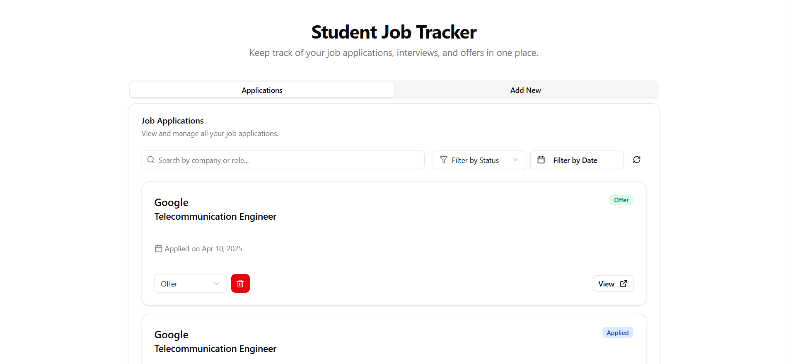
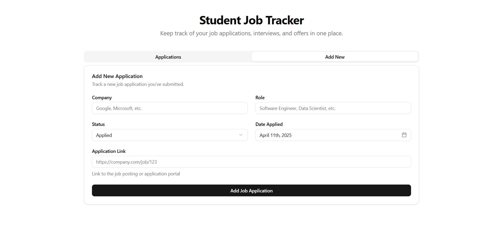
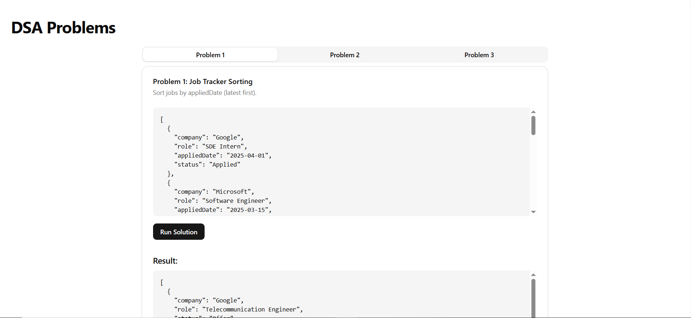

# Job Tracker MERN


---

## 📌 Description

**Job Tracker MERN** is a full-stack web application designed to help users efficiently track their job applications. Built with the MERN stack (MongoDB, Express.js, React, Node.js), it offers a seamless experience for managing job search activities.

Key features include:
- ✅ User authentication and authorization (under development)
- 📄 Create, read, update, and delete job applications
- 🔍 Search and filter job entries

---

## 📦 Installation Guide

### Prerequisites

- Node.js (v14 or higher)
- MongoDB (local or Atlas)
- npm or yarn

### Steps

1. **Clone the repository:**
   ```bash
   git clone https://github.com/shivom007/job-tracker-mern.git
   cd job-tracker-mern
   ```

2. **Install server dependencies:**
   ```bash
   cd server
   npm install
   ```

3. **Set up environment variables:**
   Create a `.env` file in the `server` directory and add the following:
   ```env
   MONGO_URI=your_mongodb_connection_string
   PORT=your_desired_port
   ```

4. **Start the server:**
   ```bash
   npm run dev
   ```

5. **Install client dependencies:**
   Open a new terminal window:
   ```bash
   cd client
   npm install --legacy-peer-deps
   ```

6. **Start the client:**
   ```bash
   npm run dev
   ```

7. **Access the application:**
   Navigate to `http://localhost:5173` in your browser.

---

## 🚀 Usage Examples

Upon launching the application:

- **Add Job Application:** Click on "Add New" to input details like company name, role, status, etc.
- **Edit/Delete:** Click on "applications" tab to list all applications and Update or remove job entries as needed.
- **DSA:** Head over to "/dsa" for DSA questions with their solution with the real-time data.

> 📸 *Screenshots and GIFs can be added here to demonstrate the application's features.*



---

## 🧱 Tech Stack

- **Frontend:**
  - React
  - React Router Dom
  - Tailwind
  - Shadcn UI

- **Backend:**
  - Node.js
  - Express.js
  - MongoDB with Mongoose

- **Development Tools:**
  - Visual Studio Code
  - Postman
  - Git & GitHub

---

## ❓ FAQ / Troubleshooting

**Q:** *The application doesn't start after running `npm run dev`. What should I do?*  
**A:** Ensure all dependencies are installed correctly in both the `client` and `server` directories. Also, verify that your `.env` file has the correct configurations.

**Q:** *How do I connect to MongoDB Atlas?*  
**A:** Replace the `MONGO_URI` in your `.env` file with your MongoDB Atlas connection string.

**Q:** *Can I deploy this application?*  
**A:** Yes! You can deploy the backend to platforms like Heroku or Render and the frontend to Netlify or Vercel. Ensure environment variables are set appropriately in the production environment.

---

> _Maintained with ❤️ by Shivom 
